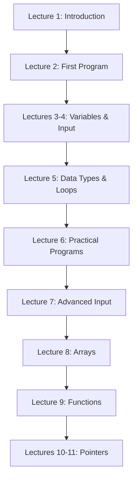

# C++ Programming Course

A comprehensive C++ programming course covering fundamentals to advanced concepts with video tutorials and practical exercises.

## 📚 Course Contents

### Lecture 1: Introduction to C++
Learn the basics of programming and set up your development environment.

**Topics Covered:**
- What is Program & Programming?
- Language Types & Categories
- Programming Language Types
- Where does C++ fit in?
- Download & Install Code::Blocks

**📹 Video:** [Watch Lecture 1](https://youtu.be/d0yp9Lzwokc)

---

### Lecture 2: First Program, Output & Arithmetic Operations
Write your first C++ program and learn basic operations.

**Topics Covered:**
- First Program in C++
- Output instructions: `\n` and `endl`
- Escape Sequences & Characters
- `namespace std`
- Arithmetic Operators
- Remainder (Modulus) Operator

**📹 Videos:**
- [Part 1](https://youtu.be/pvTt03zN4UE)
- [Part 2](https://youtu.be/eu6nD8y_nCo)

**🎯 Practice:**
- [Practice Problems Playlist](https://www.youtube.com/playlist?list=PLCZPUiJ5kQaE9LPaQA9jtiLeGP28xRhlF) - Questions on output (`cout`), escape sequences, and mathematical operations

---

### Lectures 3 & 4: Variables, Input & Control Flow
Master variables, user input, and decision-making structures.

**Topics Covered:**
- Variable Initialization Options
- `cin` Syntax & Usage
- Insertion vs Extraction Stream Operators
- Console Input Behavior
- Return Key (Enter) Functionality
- Decision Making: If Conditions
- Conditional Operators
- Nested If Statements
- Input & Condition Practice

**📹 Videos:**
- [Part 1](https://youtu.be/X37ynOFQAE0)
- [Part 2](https://youtu.be/BxF2314AAoU)
- [Part 3](https://youtu.be/k1q6Q8-B9Zw)

---

### Lecture 5: Advanced Input, Data Types & Loops
Explore data types, operators, and loop structures.

**Topics Covered:**
- Multiple Variables with `cin`
- Delimiters: Enter, Space, Tab
- String Input with Spaces
- Single vs Multiple Comments
- `bool` Data Type
- Boolean & Conditions Relationship
- `float` vs `double`
- Data Type Modifiers
- Compound Assignment Operators
- Prefix & Postfix Increment/Decrement
- Loop Fundamentals (4 Components)
- `for` and `while` Loop Syntax
- Loop Practice Problems

**📹 Videos:**
- [Part 1](https://youtu.be/QFCgIutXZzU)
- [Part 2](https://youtu.be/0JlnYtHCu4Y)
- [Part 3](https://youtu.be/UMG3ULx1TTA)
- [Part 4](https://youtu.be/DHiYM9C45jA)
- [Part 5](https://youtu.be/BRJBjWhykS8)

---

### Lecture 6: Loop Types & Practical Programs
Choose the right loop type and build real programs.

**Topics Covered:**
- Sum of Numbers (1-20)
- Sum of Even Numbers
- Sum of Odd Numbers
- Combined Even/Odd Sum (Single Loop)
- Variable Scope
- Number Multiples
- Arithmetic Overflow
- `break` & `continue` Statements
- Loop Type Selection Guide
- When to Use: `for`, `while`, `do-while`

**Practical Programs:**
1. Positive Number Validator
2. Simple Calculator with Repeat
3. String Input with Spaces (`getline()`)

**📹 Videos:**
- [Part 1](https://youtu.be/-KGYxT0XdTY)
- [Part 2](https://youtu.be/C4Q01ieBmiE)
- [Part 3](https://youtu.be/iLnMi2WEa_c)
- [Part 4](https://youtu.be/547nMcX8oPk)
- [Part 5](https://youtu.be/oXMFcjgoJIM)

---

### Lecture 7: Input Buffer, Manipulators & Type Conversions
Handle input properly and work with type conversions.

**Topics Covered:**
- Input Buffer Management
- Stream Manipulators
- `string(num, char)` Function
- Logical Operators (`&&`, `||`, `!`)
- Conditional (Ternary) Operator `?:`
- Data Type Conversion & Casting
- Character ASCII Codes

**📹 Videos:**
- [Part 1](https://youtu.be/SiT4cYFrkz4)
- [Part 2](https://youtu.be/qolskncis40)
- [Part 3](https://youtu.be/fFIe2T6Vgmk)
- [Part 4](https://youtu.be/cUt1mojI96U)
- [Part 5](https://youtu.be/7c9ePYEd32s)
- [Part 6](https://youtu.be/rM_ax4sD0Ew)

---

### Lecture 8: Arrays
Store and manipulate collections of data.

**Topics Covered:**
- 1D Arrays
  - Definition & Purpose
  - When to Use Arrays
  - Display vs Receive Operations
  - Array Memory Addresses
- 2D Arrays
- Array Class Template

**📹 Videos:**
- [Part 1](https://youtu.be/iYfRkWKAH1Q)
- [Part 2](https://youtu.be/AMhwe9Ry24c)
- [Part 3](https://youtu.be/2uWChodXaLM)

---

### Lecture 9: Functions
Organize code with reusable functions.

**Topics Covered:**
- Why Functions are Needed
- Function Syntax & Definition
- Function Placement in Code
- Function Prototypes
- Function Overloading
- Variable Scope: Local vs Global vs Static
- Scope Resolution Operator `::`
- Tricky Questions & Best Practices

**📹 Videos:**
- [Part 1](https://youtu.be/G7vx6AvEiC8)
- [Part 2](https://youtu.be/hDX2DdZ8xgI)
- [Part 3](https://youtu.be/HmPAGeWjb4I)

---

### Lectures 10 & 11: Pointers
Master memory management with pointers.

**Topics Covered:**
- What are Pointers & Why Use Them?
- Pointer Syntax & Examples
- Pointers with Functions
  - Pass by Value
  - Pass by Address
- Memory Regions: Stack vs Heap vs Global
- Advanced Pointer Concepts
- Compiler vs Developer Memory Management
- Dynamic vs Static Allocation
- Stack Overflow Errors
- Pointers with Arrays
- Dangling Pointers
- Memory Leaks
- Practical Examples

**📹 Videos:**
- [Part 1](https://youtu.be/wLFW94o_fps)
- [Part 2](https://youtu.be/i0EQlReL4eM)
- [Part 3](https://youtu.be/1Rt8wxaSrSI)

---

## 🎯 Learning Path

## 🛠️ Prerequisites

- **IDE:** Code::Blocks (Download instructions in Lecture 1)
- **Compiler:** GCC/G++ (included with Code::Blocks)
- **Operating System:** Windows, Linux, or macOS

## 📖 How to Use This Course

1. **Follow the order:** Start from Lecture 1 and progress sequentially
2. **Watch videos:** Each lecture includes video tutorials
3. **Practice:** Complete the practice problems after each lecture
4. **Code along:** Write the code yourself while watching videos
5. **Review:** Revisit previous lectures when needed

## 💡 Tips for Success

- ✅ Practice coding daily
- ✅ Complete all exercises before moving to the next lecture
- ✅ Don't skip the practice playlist
- ✅ Debug your own code before checking solutions
- ✅ Take notes on key concepts

## 🤝 Contributing

Found an issue or want to contribute? Feel free to:
- Open an issue
- Submit a pull request
- Suggest improvements

## 📝 License

This course content is provided for educational purposes.

## 📧 Contact

For questions or feedback, please open an issue in this repository.

---

**Happy Coding! 🚀**

*Star ⭐ this repository if you find it helpful!*